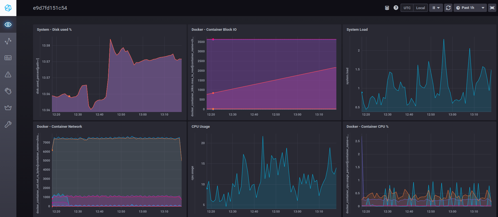

This is the repository for the blog post
## [Monitoring Raspberry Pi 4 performance in real time](https://brjapon.medium.com/monitoring-raspberry-pi-4-performance-in-real-time-fd598d46c273)

Running the **InfluxDB**-**Telegraf**-**Chronograph** stack is simple as running docker compose from the root of the repository:
>`docker-compose up -d`

Visit Chronograph interface at http://localhost:8888 . The default dashboard for your host is like this:

You can import one or all of sample dashboards located in folder `./dashboards`. Find the detailed process about how to do it in [this article](https://brjapon.medium.com/monitoring-raspberry-pi-4-performance-in-real-time-fd598d46c273)).

# Background
Find a serie of articles of the serie **Hands on Development with Raspberry Pi 4** at my blog at [Medium.com](https://brjapon.medium.com/)

The primary goal of this serie of 4 articles is to setup a workspace on a high performance and cost effective setup, intended both for rapid prototyping, as well as for fast transfer to a production environment. The scope is suitable for **cluster management** (using **Docker**, and even **Kubernetes**), as well as for **IoT projects** and **High-Performance Computing (HPC)**:

- For **cluster management** because it lets us experiment with complex deployments without the cost overhead ofusing any cloud provider (like AWS or Google Cloud). Adding more physical machines to the cluster is as simple as adding new Raspberry Pi’s to the setup, whose cost is negligible with respect to using virtual machines in the cloud. This way we cut the development costs of the infraestructure, and we will only move to the cloud when the infraestructure is ready for deployment in production.

- For **IoT projects** because the tiny Raspberry Pi is the most common SBC board of choice (Single Board Computer) for adding edge computing capabilities to IoT infrastructures, as well as streaming data from sensor to cloud server for IoT consummers, i.e. end user applications.

- For **High-Performance Computing (HPC)** because we can quickly learn how to setup such an enviroment in a simpler network of several Raspberry Pi’s. HPC is used in the backend of IoT based services, Artificial Intelligence computation and Bioinformatics.

Below is the index of the articles of the serie, also providing the URL for each one:
- [Part 1: Getting the most from Raspberry Pi 4](https://brjapon.medium.com/getting-the-most-from-raspberry-pi-4-d19c21146480), whose concrete scope is to integrate a M.2 SSD physical disk with a 64 bits operating system running the Raspberry Pi, that provides 4Gb RAM.
- [Part 2: Installing Docker in Raspberry Pi 4](https://brjapon.medium.com/setting-up-ubuntu-20-04-arm-64-under-raspberry-pi-4-970654d12696), that focuses in development methodology and shows the process to prepare a Docker ready development environment.
- [Part 3: Deploying Theia IDE using Docker](https://brjapon.medium.com/part-3-deploying-theia-ide-using-docker-740f8e2de841). In this part we will explain how to have a full featured IDE for editing code in a headless Raspberry Pi. This way we skip the need of a monitor, keyboard and mouse for the board. Hence we will confortably work from our laptop without the cumbersome need of additional hardware.
- [Part 4: Monitoring Raspberry Pi 4 performance in real time](https://brjapon.medium.com/monitoring-raspberry-pi-4-performance-in-real-time-fd598d46c273). To finish the serie we provide a simple and powerful example of how to deploy an application using Docker Compose. We will build a Chronograf dashboard of top of InfluxDB and Telegraf using Docker Compose.

This repository corresponds to part 4 of the serie.